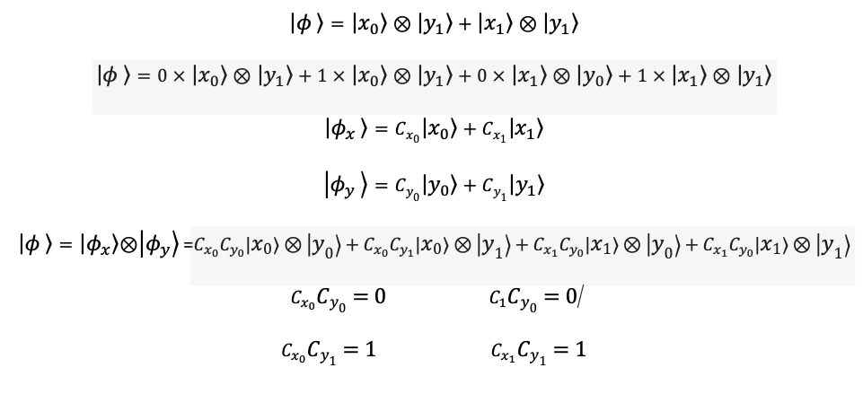

#Explicaciónes Ejercicios 4.5.2 y 4.5.3

##**_Ejercicio 4.5.2_**

Escribir un vector de estado generico para un sistema de
dos particulas con spin. Generalizarlo con n particulas.

Primero creamoslos vectores de estado generico para dos particulas
con Spin, con up y down respectivamente como podemos ver en la
imagen a continuación.

Escribimos los vectores de estado respectivos y realizamos el
producto tensor correspondiente:

Lo mismo haremos generalizandolo con n particulas, escribimos n
vectores de estado y realizamos el producto tensor entre ellos de la
siguiente manera:

##**_Ejercicio 4.5.3_**

Tomando el el ejemplo 4.5.2 y el estado que nos presentan, nos preguntan
si es separable.

Que un estado sea separable significa que puede ser expresado como el porducto tensor
de dos vectores separados. Para lo que realizamos el siguiente planteamiento:

Resolviendo cada una de las ecuaciones, podemos ver que un sistema no depende
del otro por lo que podemos decir que los estados son separables.

###Autores:
_Isabella Manrique, Ingenieria de Sistemas, Ciencias Naturales y Tecnologia_